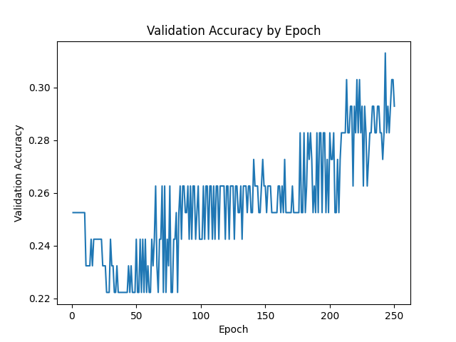
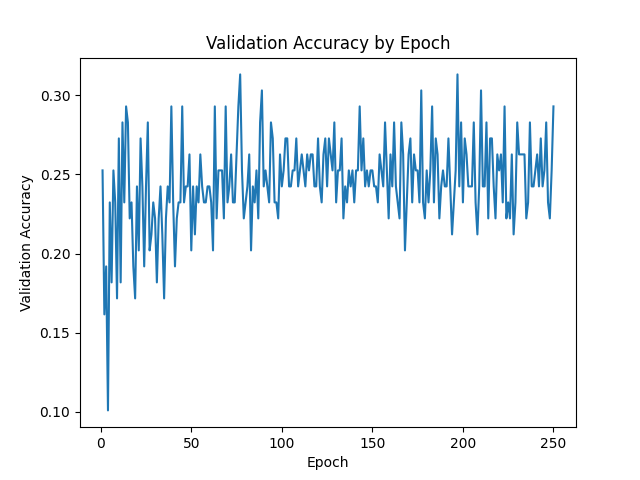

# LT2222-assignment-3
Final assignment for LT2222 machine learning course

## Part 4: Evaluation
To describe the evaluative data, we can first say that there was some experimentation with the hyperparameters and model design in an attempt to maximize performance. Hidden dimensions and learning rate for example were adjusted, but these changes appeared to have little effect on performance, so these were returned to defaults (128 and 0.001 respectively).  The first transcribed run below included required input hyperparameters dimensionality 200, epochs 250, and batch size 32.  In this initial training run, accuracy was low (0.250) and a limited number class types were apparently predicted for all the examples, as shown in *Evaluative Data 1* below: *entertainment*, *politics*, *science/technology*, and *sports*, with *science/technology* receiving the most predictions by far (143 of 204 predictions).  An interesting note here is that it appears that in this iteration the model learned by heavily favoring *science & technology* - the class with the highest number of examples - as the class for each of the samples.

While the model performed poorly, there may be some cause for optimism.  First, it did perform better than mere chance.  Given that there are 7 classes, 'chance' might be determined to be 14.3% (1/7 = 0.143), and compared to accuracy here (0.250), the model might be seen to have performed a fair amount better.  This accuracy determination demonstrates a model that is perhaps far from 'good', but rating above chance suggests that learning did take place.  Second, this learning might also be determined by the steady loss reduction - the measure of the difference between the model’s predictions and the gold-standard labels - over the 250 epochs (Rao & McMahan, 2019, p. 3).  Loss reduction was reported from 1.897 to 1.850 over the first 10 epochs and continued to 1.785 in the final 10 epochs, shown in *Loss & Validation* below.  This suggests that optimization continued during training, although the evaluation results indicate that any learning was relatively limited.

### Evaluative Data 1

**Accuracy:** 0.250

| **Confusion Matrix** | | | | | | | |
|---|---:|---:|---:|---:|---:|---:|---:|
| true \ predicted | ent | geo | health | pol | sci/tech | sports | travel |
| entertainment | 0 | 0 | 0 | 3 | 16 | 0 | 0 |
| geography | 2 | 0 | 0 | 6 | 7 | 2 | 0 |
| health | 1 | 0 | 0 | 4 | 16 | 1 | 0 |
| politics | 0 | 0 | 0 | 7 | 19 | 4 | 0 |
| science/technology | 0 | 0 | 0 | 9 | 41 | 1 | 0 |
| sports | 1 | 0 | 0 | 9 | 12 | 3 | 0 |
| travel | 0 | 0 | 0 | 7 | 32 | 1 | 0 |

Rows = true labels  
Columns = predicted labels  

|**Loss & Validation** | | | | | |
|-------|----------|------------|-------|----------|------------|
| Epoch | Loss     | validation | Epoch | Loss     | validation |
| 1/250   | 1.897  | 0.253 | 241/250 | 1.785  | 0.273 |
| 2/250   | 1.875  | 0.253 | 242/250 | 1.795  | 0.283 |
| 3/250   | 1.870  | 0.253 | 243/250 | 1.791  | 0.313 |
| 4/250   | 1.869  | 0.253 | 244/250 | 1.783  | 0.283 |
| 5/250   | 1.865  | 0.253 | 245/250 | 1.784  | 0.293 |
| 6/250   | 1.862  | 0.253 | 246/250 | 1.784  | 0.283 |
| 7/250   | 1.859  | 0.253 | 247/250 | 1.782  | 0.293 |
| 8/250   | 1.858  | 0.253 | 248/250 | 1.786  | 0.303 |
| 9/250   | 1.854  | 0.253 | 249/250 | 1.786  | 0.303 |
| 10/250  | 1.850  | 0.253 | 250/250 | 1.785  | 0.293 |

### Bonus 1: Validation

To add another perspective to the evaluation (and in accord with the first bonus portion), *validation* was added to the model.  This optional addition (see training and evaluation options below regarding running the scripts) adds feedback per epoch indicating measurable learning the model is doing during training (Rao & McMahan, 2019).  This metric provides a useful contrast to loss metrics, and it is possible to see a reduction in loss while at the same time a stagnation in actual learning as expressed in validation accuracy.  In the case of this particular training run, however, validation accuracy continued to improve steadily over the course of the 250 epochs, seen in the graph below.

**Validation Accuracy**

### Modification: Class Weighting

Given that the model focused predictions largely on a single class, an adjustment to the model was considered, and (optional) class weighting was added to the loss function.  To promote higher distribution of prediction across all classes, greater penalties were applied for wrong predictions on underrepresented classes, discouraging dominant class predictions.  This resulted in a reduction in accuracy, however, to 0.216, but greater variation was demonstrated in predicting the different classes - with all classes being represented in the predictions - as shown in *Evaluative Data 2* below.

### Evaluative Data 2 ###
**Accuracy:** 0.216

| **Confusion Matrix** | | | | | | | |
|---|----|----|----|----|----|----|----|
| true \ predicted | ent | geo | health | pol | sci/tech | sports | travel |
| entertainment | 0 | 0 | 6 | 3 | 0 | 1 | 9 |
| geography | 2 | 2 | 2 | 6 | 1 | 0 | 4 |
| health | 1 | 1 | 5 | 4 | 0 | 0 | 11 |
| politics | 0 | 3 | 12 | 8 | 1 | 1 | 5 |
| science/technology | 0 | 1 | 11 | 8 | 3 | 2 | 26 |
| sports | 4 | 3 | 4 | 5 | 3 | 1 | 5 |
| travel | 1 | 1 | 4 | 5 | 3 | 1 | 25 |

Rows = true labels  
Columns = predicted labels  

As seen in *Evaluative Data 2* above, all of the classes were included in the predictions in this version of the model.  Predictions were largely spread across 3 classes, with *travel* receiving the most predictions (75), *health* receiving the second most (44) and *politics* receiving the third most (39).  The hope with class weighting was to avoid a situation where prediction numbers wouldn't collapse into a single (or mostly single) class; this did seem to work at the expense of accuracy (from 0.250 down to 0.216).  This may arguably demonstrate a more positive result in that the model attempted broader prediction class distribution and the previous model only *appears* more accurate by merely defaulting to the one class that exhibits the greatest number of samples (*science/technology*).  This claim ultimately falls short, as the validation performance for the class weighted run seemed to plateau somewhat early in the run (see *Validation Performance 2* below).  This suggests that further performance improvement would be unlikely and contrasts with the steady improvement exemplified in the first, unweighted evaluation run above.
 

**Validation Accuracy, Class Weighting**

## Part 5: Documentation

This project implements a machine learning pipeline for multiclass topic classification in Simplified Chinese using FastText sentence embeddings and a feed-forward neural network in PyTorch.

The pipeline consists of three main stages:

1. sentence embedding generation
2. neural network training
3. evaluation and confusion matrix analysis

### How to run the scripts 

Run all commands from the root project folder: LT2222-assignment-3

1. **Create sentence embeddings**
   - the following command trains one shared FastText model on the training, development, and test files, then creates one sentence-embedding file for each split 
   - modifies the default embedding dimension from 50 to 200 (--dim 200): 
    `python src/train_embeddings.py --inputs train.tsv dev.tsv test.tsv --outputs src/train_embeddings.tsv src/dev_embeddings.tsv src/test_embeddings.tsv --dim 200`

 

2. **Train the neural classifier**
   - the following command initiates a standard training run, includes hyperparameters for epochs (250) and batch size (32) (--epochs 250, --batch_size 32): 
     `python src/train_classifier.py --train_tsv train.tsv --embeddings src/train_embeddings.tsv --output_model src/topic_model.pt --epochs 250 --batch_size 32`

   - bonus 1: validation-enabled training run using the same hyperparameters as above (--epochs 250, --batch_size 32): 
     `python src/train_classifier.py --train_tsv train.tsv --embeddings src/train_embeddings.tsv --dev_tsv dev.tsv --dev_embeddings src/dev_embeddings.tsv --output_model src/topic_model.pt --epochs 250 --batch_size 32 --plot_output images/validation_accuracy.png`
     
   - optional class-weighting modification with validation (--epochs 250, --batch_size 32): 
     `python src/train_classifier.py --train_tsv train.tsv --embeddings src/train_embeddings.tsv --dev_tsv dev.tsv --dev_embeddings src/dev_embeddings.tsv --output_model src/topic_model_weighted.pt --epochs 250 --batch_size 32 --plot_output images/validation_accuracy_weighted.png --use_class_weights`

 

3. **Evaluate the model**
   - evaluation of the standard model on the test set: 
        `python src/evaluate_classifier.py --train_tsv test.tsv --embeddings src/test_embeddings.tsv --model src/topic_model.pt`

   - evaluation of the class-weighted model on the test set: 
        `python src/evaluate_classifier.py --train_tsv test.tsv --embeddings src/test_embeddings.tsv --model src/topic_model_weighted.pt`

 

## Files
### Sentence Embedding Generation | `train_embeddings.py` 

Trains one shared FastText embedding model across the training, development, and test corpora, then converts sentences into averaged sentence embeddings.

**Input Files**
- `train.tsv`
- `dev.tsv`
- `test.tsv`

**Output Files**
- `train_embeddings.tsv`
- `dev_embeddings.tsv`
- `test_embeddings.tsv`

 

**Main parameters**
| parameter | description |
|-----------|-------------|
| `--inputs` | paths to input .tsv files |
| `--outputs` | paths to output embedding files |
| `--dim`	| embedding vector dimensionality |

 

### Neural Network Training | `train_classifier.py`

Loads sentence embeddings and topic labels, then trains a feed-forward neural network classifier in PyTorch.

**Input**
- `train.tsv`
- `train_embeddings.tsv`
- optional: `dev.tsv`
- optional: `dev_embeddings.tsv`

**Output**
- `topic_model.pt`
- optional: `topic_model_weighted.pt`
- optional: validation accuracy `.png`

 

**Main Parameters**
| parameter | description |
|-----------|-------------|
| `--train_tsv` | path to training .tsv |
| `--embeddings` | path to sentence embeddings |
| `--output_model` | output path for trained model |
| `--epochs` | number of training epochs |
| `--batch_size` | mini-batch size |

 

**Optional Training Parameters**

| parameter | description |
|-----------|-------------|
| `--dev_tsv` | optional validation .tsv file |
| `--dev_embeddings` | optional validation embeddings file (bonus 1) |
| `--plot_output` | output path for validation accuracy plot (.png) |
| `--use_class_weights` | enables class-weighted loss during training |

 

### Evaluation and Confusion Matrix Analysis | `evaluate_classifier.py`

Evaluates the trained classifier using accuracy metrics and a confusion matrix.

**Input**
- `test.tsv`
- `test_embeddings.tsv`
- `trained_model.pt`

**Output**
- terminal evaluation output
- accuracy
- confusion matrix

 

**Main parameters**
| parameter | description |
|-----------|-------------|
| `--train_tsv` | path to evaluation .tsv file |
| `--embeddings` | path to embeddings file |
| `--model` | path to trained model |

 

### Transcript

A transcript of the final MLT GPU session is included in:

`transcript_mltgpu_final.txt`

## References

Rao, D., & McMahan, B. (2019). *Natural language processing with PyTorch: Build intelligent language applications using deep learning.* O’Reilly Media. https://ebookcentral.proquest.com/lib/gu/reader.action?c=UERG&docID=5639028