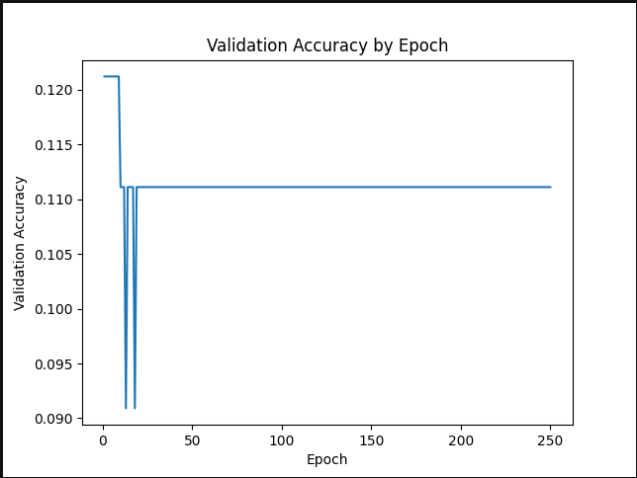

# LT2222-assignment-3
Final assignment for LT2222 machine learning course

## Part 4: Evaluation
To describe the evaluative data, we can first say that there was some experimentation with the hyperparameters and model design in an attempt to maximize performance. Initial hyperparameters included 100 vector dimensions, batch size 32, hidden dimensions 64, and training occurred over 10 epochs.  In this initial training run, accuracy was low (0.251) and only one class type was apparently predicted for all the examples, as shown in *Evaluative Data 1* below.  An interesting note here is that it appears that in this iteration the model learned by selecting *science & technology* - the class with the highest number of examples - as the class for each of the samples.

### Evaluative Data 1 ###
**Accuracy:** 0.2511

**Confusion Matrix**
| true \ predicted | ent | geo | health | pol | sci/tech | sports | travel |
|---|---:|---:|---:|---:|---:|---:|---:|
| entertainment | 0 | 0 | 0 | 0 | 65 | 0 | 0 |
| geography | 0 | 0 | 0 | 0 | 58 | 0 | 0 |
| health | 0 | 0 | 0 | 0 | 77 | 0 | 0 |
| politics | 0 | 0 | 0 | 0 | 102 | 0 | 0 |
| science/technology | 0 | 0 | 0 | 0 | 176 | 0 | 0 |
| sports | 0 | 0 | 0 | 0 | 85 | 0 | 0 |
| travel | 0 | 0 | 0 | 0 | 138 | 0 | 0 |

Rows = true labels  
Columns = predicted labels  

To improve upon this, a number of changes were made, including hyperparameters, but also a change to the model itself.  First, class weighting was added to the loss function, where greater penalties are applied for wrong predictions on underrepresented classes, discouraging dominant class predictions.  Along with this, vector dimensions were increased to 200, hidden dimensions were increased to 128, and epochs were increased to 250 (testing iterations saw as high as 500 epochs for training, but at this number virtually no loss was reduced past a certain point, and it was determined that 250 represented a 'sweet spot' where potential for loss reduction began to see diminishing returns).  This resulted in a (very) small boost in accuracy to 0.271, but greater variation was demonstrated in predicting the different classes, as shown in *Evaluative Data 2* below.

### Evaluative Data 2 ###
**Accuracy:** 0.2710

**Confusion Matrix**

| true \ predicted | ent | geo | health | pol | sci/tech | sports | travel |
|---|---:|---:|---:|---:|---:|---:|---:|
| entertainment | 0 | 2 | 9 | 20 | 13 | 2 | 19 |
| geography | 0 | 6 | 5 | 8 | 14 | 10 | 15 |
| health | 0 | 6 | 20 | 10 | 14 | 2 | 25 |
| politics | 0 | 6 | 22 | 28 | 18 | 8 | 20 |
| science/technology | 0 | 8 | 22 | 15 | 73 | 4 | 54 |
| sports | 0 | 13 | 7 | 18 | 21 | 8 | 18 |
| travel | 0 | 5 | 24 | 6 | 44 | 4 | 55 |

Rows = true labels  
Columns = predicted labels  

As seen in *Evaluative Data 2* above, all but one of the classes (*entertainment*) was included in the predictions in this version of the model.  However, *science/technology* continued to receive the greatest number of predictions, and this was also the class with the highest recall score (73/176 = 0.413; see also *Per-Class Recall* below).  Other evaluation attempts with differing configurations of hyperparameters were made - including increasing the learning rate (attempting a rate as high as 0.5) - but these iterations only served to reduce performance, where accuracy was seen as low as 0.190.

### Per-Class Recall ###
| class | recall | calculation |
|---|---:|---|
| science/technology | 0.415 | 73/176 = 0.415 |
| travel | 0.399 | 55/138 = 0.399 |
| politics | 0.275 | 28/102 = 0.275 |
| health | 0.260 | 20/77 = 0.260 |
| geography | 0.103 | 6/58 = 0.103 |
| sports | 0.094 | 8/85 = 0.094 |
| entertainment| 0 | 0/65 = 0 |

 
While the model performed poorly, there may be some cause for optimism.  First, it did perform better than mere chance.  Given that there are 7 classes, 'chance' might be determined to be 14.3% (1/7 = 0.143), and compared to accuracy here (27.1%), the model might be seen to have performed a fair amount better.  This accuracy determination demonstrates a model that is perhaps far from 'good', but this difference suggests that learning did take place.  Second, this learning might also be determined by the steady loss reduction - the measure of the difference between the model’s predictions and the gold-standard labels - over the 250 epochs (Rao & McMahan, 2019, p. 3).  Loss reduction was reported from 1.95 to 1.94 over the first 10 epochs and continued to 1.88 in the final 10 epochs.  This suggests that optimization continued during training, although the evaluation results indicate that any learning was limited.

### Training Loss by Epoch for Final Evaluation ###
first 10 and final 10 epochs

| Epoch | Loss     | Epoch | Loss     |
|-------|----------|-------|----------|
| 1/250   | 1.9523  | 241/250 | 1.8805  |
| 2/250   | 1.9482  | 242/250 | 1.8845  |
| 3/250   | 1.9476  | 243/250 | 1.8819  |
| 4/250   | 1.9469  | 244/250 | 1.8837  |
| 5/250   | 1.9482  | 245/250 | 1.8825  |
| 6/250   | 1.9469  | 246/250 | 1.8804  |
| 7/250   | 1.9479  | 247/250 | 1.8838  |
| 8/250   | 1.9469  | 248/250 | 1.8819  |
| 9/250   | 1.9470  | 249/250 | 1.8824  |
| 10/250  | 1.9459  | 250/250 | 1.8837  |

 

### Bonus 1: Validation

For the first bonus part, validation was added to the model.  This optional addition (see training and evaluation options below regarding running the scripts) adds feedback per epoch indicating measurable learning the model is doing during training (Rao & McMahan, 2019).  This *validation* provides a useful contrast to loss metrics, and it is possible to see a reduction in loss but at the same time a stagnation in actual learning, and this is what our model exhibited when run with the same metrics and validation enabled.

**Validation Performance**

Similar to the above runs, the training run here made with validation accuracy demonstrates this very dynamic.  While loss shows a nearly identical pattern (dropping from approximately 1.95 to approximately 1.88) over the course of 250 epochs before plateuing, the validation metric seen in the above *Validation Performance* plot, peaks early in the training at approximately 10 epochs.  This suggests that the model did not gain any meaningful learning after this point, and given the overall poor performance of the model, this also likely means that no further training would benefit performance.  Additionally, this also implies that the model did not improve its ability to generalize beyond the training data after the early epochs.

## Part 5: Documentation

This project implements a machine learning pipeline for multiclass topic classification in Simplified Chinese using FastText sentence embeddings and a feed-forward neural network in PyTorch.

The pipeline consists of three main stages:

1. sentence embedding generation
2. neural network training
3. evaluation and confusion matrix analysis

### How to run the scripts 

Run all commands from the root project folder: LT2222-assignment-3

1. **Create sentence embeddings**
   - command-line function with final determined hyperparameters (--dim 200): 
    `python src/train_embeddings.py --input "..\downloaded files\train.tsv" --output "src\train_embeddings.tsv" --dim 200`

   - command-line function with final determined hyperparameters (--dim 200) including validation (bonus 1): 
    `python src/train_embeddings.py --input "..\downloaded files\dev.tsv" --output "src\dev_embeddings.tsv" --dim 200`
  

2. **Train the neural classifier**
   - command-line function with final determined hyperparameters (--epochs 250, --batch_size 32): 
     `python src/train_classifier.py --train_tsv "..\downloaded files\train.tsv" --embeddings "src\train_embeddings.tsv" --output_model "src\topic_model.pt" --epochs 250 --batch_size 32`

   - command-line function with final determined hyperparameters (--epochs 250, --batch_size 32) including validation (bonus 1): 
     `python src/train_classifier.py --train_tsv "..\downloaded files\train.tsv" --embeddings "src\train_embeddings.tsv" --dev_tsv "..\downloaded files\dev.tsv" --dev_embeddings "src\dev_embeddings.tsv" --output_model "src\topic_model.pt" --epochs 250 --batch_size 32 --plot_output "images/validation_accuracy.png"`
  

3. **Evaluate the model**
   - command-line function; this is the same with and without validation: 
     `python src/evaluate_classifier.py --train_tsv "..\downloaded files\train.tsv" --embeddings "src\train_embeddings.tsv" --model "src\topic_model.pt"`

 

## Files
### Sentence Embedding Generation | `train_embeddings.py` 

Trains FastText character embeddings and converts sentences into averaged sentence embeddings.

**Input**
- training .tsv file

**Output**
- .tsv file containing sentence embeddings
 
 

**Main parameters**
| parameter | description |
|-----------|-------------|
| `--input` | path to training .tsv file |
| `--output` | output path for embeddings |
| `--dim`	| embedding vector dimensionality |

 

### Neural Network Training | `train_classifier.py`

Loads sentence embeddings and topic labels, then trains a feed-forward neural network classifier in PyTorch.

**Input**
- training .tsv
- sentence embeddings .tsv

**Output**
- trained PyTorch model .pt
 
 

**Main Parameters**
| parameter | description |
|-----------|-------------|
| `--train_tsv` | path to training .tsv |
| `--embeddings` | path to sentence embeddings |
| `--output_model` | output path for trained model |
| `--epochs` | number of training epochs |
| `--batch_size` | mini-batch size |

 

**Bonus 1: Optional Validation Parameters**

| parameter | description |
|-----------|-------------|
| `--dev_tsv` | optional validation .tsv file | 
| `--dev_embeddings` | optional validation embeddings file | 
| `--plot_output` | output path for validation accuracy plot (.png) |

 

### Evaluation and Confusion Matrix Analysis | `evaluate_classifier.py`

Evaluates the trained classifier using accuracy metrics and a confusion matrix.

**Input**
- training .tsv
- sentence embeddings .tsv
- trained model .pt

**Output**
- terminal evaluation output
- accuracy
- confusion matrix
 
 

**Main parameters**
| parameter | description |
|-----------|-------------|
| `--train_tsv` | path to training .tsv |
| `--embeddings` | path to embeddings file |
| `--model` | path to trained model |

 

### Transcript

A transcript of both a complete successful terminal session running the scripts and a complete successful terminal session with optional validation is included in:

`transcript.txt`

## References

Rao, D., & McMahan, B. (2019). *Natural language processing with PyTorch: Build intelligent language applications using deep learning.* O’Reilly Media. https://ebookcentral.proquest.com/lib/gu/reader.action?c=UERG&docID=5639028